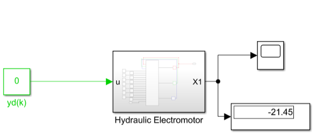
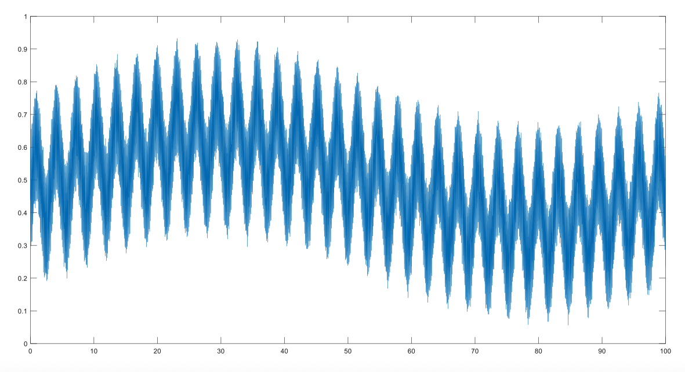
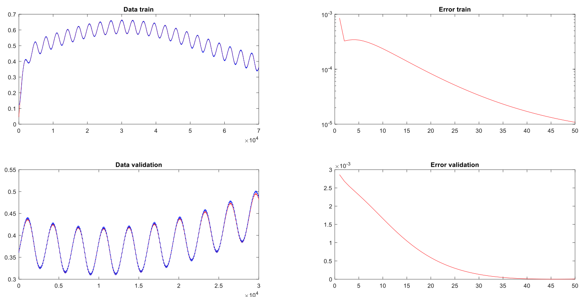
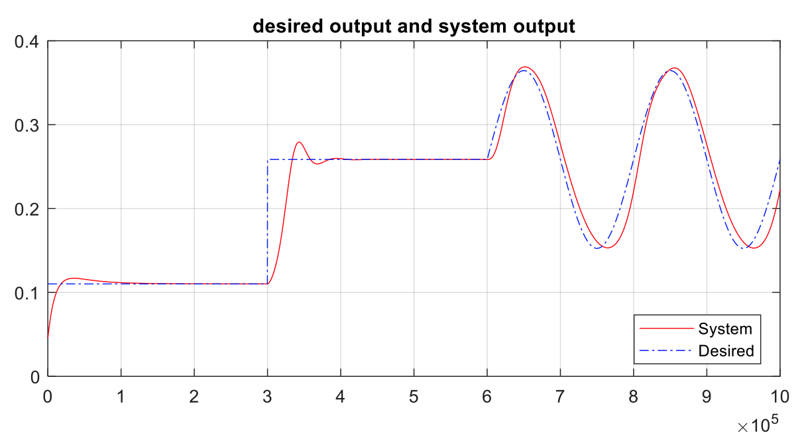

# Simulation and Control of an Electro-Hydraulic System using Neural Networks

This repository contains the simulation files for identifying and controlling an electro-hydraulic system using MLP neural networks, as detailed in the project report.

## 1. Problem Statement

The electro-hydraulic system is described by the following state equations:

-

Where *u* is the control signal generated by a neural controller. The system parameters are:

* $J\_t = 0.03$
* $B\_m = 1.1 \\times 10^{-3}$
* $q\_m = 7.96 \\times 10^{-7}$
* $C\_f = 0.104$
* $P\_s = 10^7$
* $\\beta\_e = 1.391 \\times 10^9$
* $V\_0 = 1.2 \\times 10^{-4}$
* $C\_{im} = 1.69 \\times 10^{-11}$
* $C\_d = 0.61$
* $W = 8\\pi \\times 10^{-3}$
* $\\rho = 850$
* $T\_r = 0.01$
* $K\_r = 1.4 \\times 10^{-4}$
* $K\_q = 1.66$

The goal is to control the system's output using a neural network controller. The project explores both an MLP and an RBF network for the identifier and controller.

## 2. Solution Process

The solution is divided into two main stages: system identification and controller implementation.

### 2.1 System Identification
First, an MLP neural network is trained to act as an identifier for the plant. This network has two hidden layers with 4 neurons each and a single neuron in the output layer. The weights obtained from this identification process are then used to initialize the controller.

### 2.2 Controller Implementation
The neural controller is implemented using the control structure shown below. It is an MLP network with two hidden layers, 5 neurons in the hidden layer, and one output neuron.

## Control System Diagram

## 3. Implementation Files

The MATLAB code for this project can be found in the repository:

* **Identifier:** `identification_train.m`
* **Controller:** `controller_GD.m`

## 4. Results

### 4.1 Identifier Training Results
To normalize the data, the maximum and minimum values of the system's response were determined using a Simulink model. The input range was considered to be between 0 and 3.

The upper bound of the system output was found to be approximately 450, and the lower bound was -22.

For effective system identification, the input signal was a sum of 21 sinusoidal functions with frequencies ranging from 0.01 Hz to 1000 Hz.

The results of the identification phase are shown below, comparing the system output with the identifier's output.

The final weights for the identifier network are:

**Table 1: Identifier Network Weights (w1)**
| | | | |
| :--- | :--- | :--- | :--- |
| -0.54172 | 0.331697 | 0.556305 | 1.700364 |
| -0.26 | -1.04366 | 0.136119 | -0.85665 |
| 0.686928 | 0.190326 | 0.472448 | -3.5019 |
| -0.78745 | 0.144435 | 0.929222 | -0.3474 |

**Table 2: Identifier Network Weights (w2)**
| | | | | |
| :--- | :--- | :--- | :--- | :--- |
| 2.284671 | -0.90027 | -4.0049 | -0.01226 | 2.284671 |

### 4.2 Controller Performance Results
The controller's performance was evaluated for both regulation and tracking tasks. To prevent large initial control signals, the controller weights were initialized with values obtained after a few training iterations.

**Table 3: Initial Controller Weights (w1)**
| | | | |
| :--- | :--- | :--- | :--- |
| -0.90359 | -0.69564 | 0.311481 | 0.530017 |
| -0.48133 | 0.936963 | -0.92858 | 0.492542 |
| 0.283549 | 0.935242 | 0.698259 | -0.24203 |
| 0.821049 | -0.0396 | 0.867986 | 0.325596 |
| 1.156454 | 0.625534 | 0.35747 | -0.68946 |

**Table 4: Initial Controller Weights (w2)**
| | | | | |
| :--- | :--- | :--- | :--- | :--- |
| 0.383178 | -0.10337 | -1.1324 | 0.011833 | -1.91449 |

#### Regulation Task
The system's ability to maintain a constant output (setpoint) was tested.

#### Tracking Task
The system's ability to follow a sinusoidal reference signal was tested.

